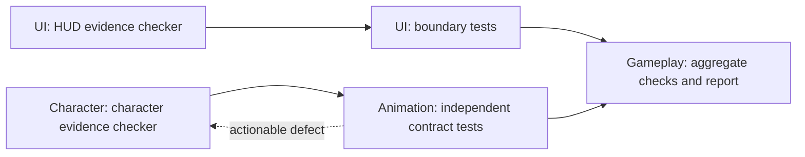

# Directed collaboration and dependency scheduling

## Behavior

- A shared update is an `update` event with no outbox recipients. It appears in the
  conversation but never starts a model turn.
- Agent `group_send_message` requires one recipient. `group_post_update` records
  information; `group_broadcast_message` explicitly requests action from everyone
  and requires a reason. User input retains an explicit whole-group option and
  now also supports a selected recipient and silent updates on PC and mobile.
- Task creation notifies only an assigned owner whose dependencies are complete.
  Unassigned backlog items, routine progress/evidence, and plan edits are silent.
- Completion notifies the owners of downstream tasks only when all their
  dependencies are complete. Independent branches can run simultaneously. Multiple
  tasks for the same node use its existing serialized queue and durable batching.
- A ready successor owned by the completing agent can wake that same agent. At
  execution time, a queued task notification rechecks current ownership, completion
  and dependencies; an obsolete notification is cancelled before model invocation.
- This is task dependency scheduling, not a global editor lock. Shared Unreal
  editor operations still require coordination; independent offline work does not
  acquire a team-wide execution window.

The notification policy lives in `src/agent_groups/task_notifications.py`.
Task event payloads persist recipient-to-task identities in `action_tasks`.
Store version 4 migrates pending old task broadcasts once, preserving relevant
owner work and user/peer messages while cancelling unrelated old recipients.
No natural-language classifier or silent message-dropping heuristic is involved.

## Focused validation

- 72 domain/API/delivery tests passed. Cases include fork/join, all-dependency
  readiness, same-owner successors, busy-member batching, reassignment/completion
  before execution, strict message contracts, idempotency, visibility, migration,
  and existing group lifecycle behavior.
- Production frontend type check and build passed.
- Actual Chrome UI with paused fixture nodes: a direct action reached only its
  selected member; a shared update produced zero deliveries; explicit broadcast
  reached both members. The mobile composer was exercised at 393 px. Fixture was
  deleted through the application API. No page errors.
- Public cloud mobile route to the real BBQ team: recipient selection and silent
  update controls verified, without sending work. Frontend artifact hashes were
  verified during cloud deployment; backup is
  `/opt/agentpark-coordinator/backups/webui-20260928T085054Z`.

## Real BBQ development exercise

The user authorized real tasks and observation. Five bounded tasks were assigned
to existing agents in `bbq-unreal-team`, group
`0fa25d70f6104a1eb8d6dcf54b4ea5ec`, starting after event 137:

The initial five task creations produced two deliveries, to UI and Character,
and those two members started concurrently. Animation and Gameplay waited for
their own dependencies; PCG and VFX received no notices from this exercise.

Animation independently found a real defect: `[null]` reference-pose entries
could be treated as valid character evidence. Event 150 sent the reproduction
directly to Character. Character reopened its task, fixed validation and reported
18 passing character tests (including Animation's eight tests). Event 154 handed
the fix directly back to Animation. UI's completed branch did not restart.
Gameplay received its automatic readiness notification at event 156, after both
the UI tests and Animation's revalidation completed.

All five tasks completed. A separate external run in a normal Windows terminal
found one additional encoding defect: the HUD test requested UTF-8 subprocess
decoding without fixing the child's output encoding. A user-authorized direct
request to UI (event 159) produced a localized fix: launch that child with
`-X utf8`, retaining strict decoding and the original failure assertions. UI
published its evidence as a silent update (event 160), with zero recipients.
The external full suite then passed all 27 tests in the default Windows
environment. Gameplay's aggregate report completed with `errors=[]` and
`status=blocked`: missing real HUD/MetaHuman acceptance evidence remains visible.

The same-owner successor exercise also exposed an unnecessary follow-up wake
when an agent finished both tasks in its original turn. The final implementation
adds persisted action identities, execution-time stale-notice cancellation and
the version-4 upgrade above. Those cases pass focused regression tests; the final
service deployment takes place after all productive runs finish.

Final deployment completed with zero active nodes in the restart checkpoint.
The running store reports version 4, the BBQ outbox has zero pending deliveries,
and local/cloud frontend assets match (`index-B0ZJYKY7.js`,
`index-DpLFSqyf.css`). The exercise persisted 5 completed tasks and 9 directed
delivery records including repair exchanges and the external UI follow-up; none
targeted PCG or VFX, and no delivery error was recorded. Ordinary task progress
and the final shared update created no whole-team notifications. These counts
describe delivery records, not token consumption or model-turn counts.

Evidence files are under `.runtime/group-routing-live/`; browser evidence is in
`.runtime/group-routing-ui-result.json`; regression results are in
`.runtime/group-routing-tests.xml`. Actual checkers and tests are under
`C:/Project/BBQ/scripts/Collaboration`. This exercise validates collaboration and
offline evidence handling, not Unreal gameplay, visuals or MetaHuman acceptance.
